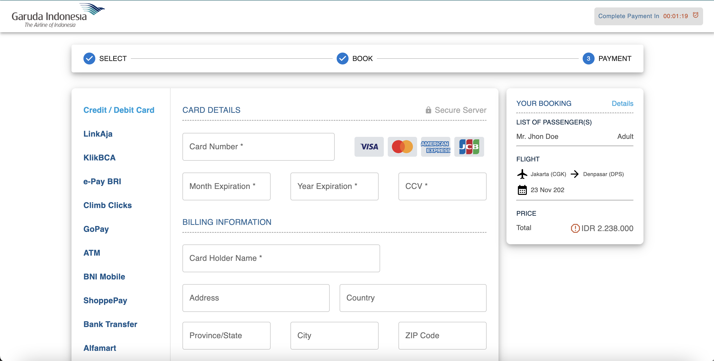

## How To Start In Local Mode

```bash
1. cd or open to project file 
2. npm install to install all depedency
3. npm run dev to start development mode
```

## Screenshots
<div align="center">
        
</div>

## Live Demo
<a href="https://ati-garuda-test.vercel.app/">
  
</a>